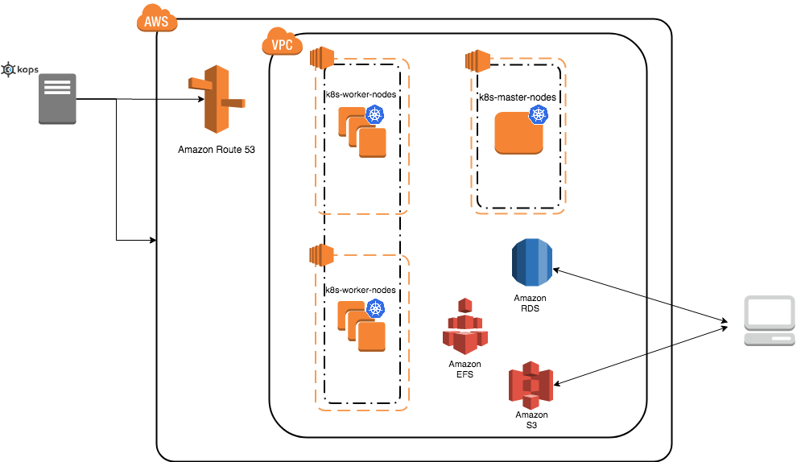

Kubernetes
==========


Kubernetes is an open-source system for automating deployment, scaling, and management of containerized applications (see `Kubernetes`_ and `Kubernetes github page`_ ). There are a lot of ways to deploy a Kubernetes cluster, for instance see `Picking the right solution`_.


Cluster creation
----------------

The nex steps follow `kops`_ and `kops - Kubernetes Operations`_ guides (another guide: `Step Zero Kubernetes on AWS`_).


1. Configure a domain and a subdomain with their respective hosted zones. For the following description `Route 53`_ service of AWS was used to create domain ``conabio-route53.net`` and subdomain ``antares3.conabio-route53.net``. Also a **gossip based Kubernetes cluster** can be used instead (see for example this `issue`_ and this `entry of blog`_).

2. Install **same versions** of kops and kubectl. We use a ``t2.micro`` instance with AMI ``Ubuntu 16.04 LTS`` and a role attached to it to install this tools with the next bash script:
 
**Note: change region in next bash script where you deployed ``t2.micro`` instance**

.. code-block:: bash

        #!/bin/bash
        ##variables:
        region=<region>
        name_instance=conabio-kubernetes
        shared_volume=/shared_volume
        user=ubuntu
        ##System update
        apt-get update
        ##Install awscli
        apt-get install -y python3-pip && pip3 install --upgrade pip==9.0.3
        pip3 install awscli --upgrade
        ##Tag instance
        INSTANCE_ID=$(curl -s http://instance-data/latest/meta-data/instance-id)
        PUBLIC_IP=$(curl -s http://instance-data/latest/meta-data/public-ipv4)
        aws ec2 create-tags --resources $INSTANCE_ID --tag Key=Name,Value=$name_instance-$PUBLIC_IP --region=$region
        ##Set variables for completion of bash commands
        echo "export LC_ALL=C.UTF-8" >> /home/$user/.profile
        echo "export LANG=C.UTF-8" >> /home/$user/.profile
        ##Set variable mount_point
        echo "export mount_point=$shared_volume" >> /home/$user/.profile
        ##Useful software for common operations
        apt-get install -y nfs-common jq git htop nano
        ##Create shared volume
        mkdir $shared_volume
        ##install docker for ubuntu:
        apt-get install -y apt-transport-https ca-certificates curl software-properties-common
        curl -fsSL https://download.docker.com/linux/ubuntu/gpg | sudo apt-key add -
        add-apt-repository "deb [arch=amd64] https://download.docker.com/linux/ubuntu $(lsb_release -cs) stable"
        apt-get update
        apt-get install -y docker-ce
        service docker start
        ##install kops version 1.9.0:
        wget -O kops https://github.com/kubernetes/kops/releases/download/1.9.0/kops-linux-amd64
        chmod +x ./kops
        sudo mv ./kops /usr/local/bin/
        ##install kubernetes command line tool v1.9: kubectl
        wget -O kubectl https://storage.googleapis.com/kubernetes-release/release/v1.9.0/bin/linux/amd64/kubectl
        chmod +x ./kubectl
        sudo mv ./kubectl /usr/local/bin/kubectl
        ##enable completion for kubectl:
        echo "source <(kubectl completion bash)" >> /home/$user/.bashrc


You can check kops and kubectl versions with:

.. code-block:: bash

        $kops version

        $kubectl version


.. note:: 

        All ``kubectl`` and ``kops`` commands must be executed in this instance.


3. Set next bash variables:
 
.. code-block:: bash

        #Your domain name that is hosted in AWS Route 53
        #Use: export DOMAIN_NAME="antares3.k8s.local" #for a gossip based cluster
        export DOMAIN_NAME="antares3.conabio-route53.net"

        # Friendly name to use as an alias for your cluster
        export CLUSTER_ALIAS="k8s-deployment"

        # Leave as-is: Full DNS name of you cluster
        export CLUSTER_FULL_NAME="${CLUSTER_ALIAS}.${DOMAIN_NAME}"

        # AWS availability zone where the cluster will be created

        REGION=$(curl -s http://instance-data/latest/dynamic/instance-identity/document|grep region|awk -F\" '{print $4}')

        export CLUSTER_AWS_AZ=$(aws ec2 describe-availability-zones --region $REGION | grep ZoneName | awk '{print $2}'|tr -s '\n' ','|tr -d '"'|sed -n 's/,$//p')


        # Leave as-is: AWS Route 53 hosted zone ID for your domain (don't set it if gossip based cluster is used)
        export DOMAIN_NAME_ZONE_ID=$(aws route53 list-hosted-zones \
               | jq -r '.HostedZones[] | select(.Name=="'${DOMAIN_NAME}'.") | .Id' \
               | sed 's/\/hostedzone\///')

        export KUBERNETES_VERSION="1.9.0"

        #To hold cluster state information export KOPS_STATE_STORE
        export KOPS_STATE_STORE="s3://${CLUSTER_FULL_NAME}-state"

        export EDITOR=nano

4. Create AWS S3 bucket to hold information for Kubernetes cluster:

.. note:: 

        The instance needs the policy **AmazonS3FullAccess** attach to a role created by you to have permissions to execute next command.


.. code-block:: bash

    #Bucket will be created in us-east (N. Virginia)
    $aws s3api create-bucket --bucket ${CLUSTER_FULL_NAME}-state


5. Create group and user kops and generate access keys for user kops:


.. note:: 

        The instance needs the policy **IAMFullAccess** attach to a role created by you to have permissions to execute next command.

Create group and permissions of it:

.. code-block:: bash

        $aws iam create-group --group-name kops

        $aws iam attach-group-policy --policy-arn arn:aws:iam::aws:policy/AmazonEC2FullAccess --group-name kops

        $aws iam attach-group-policy --policy-arn arn:aws:iam::aws:policy/AmazonRoute53FullAccess --group-name kops

        $aws iam attach-group-policy --policy-arn arn:aws:iam::aws:policy/AmazonS3FullAccess --group-name kops

        $aws iam attach-group-policy --policy-arn arn:aws:iam::aws:policy/IAMFullAccess --group-name kops

        $aws iam attach-group-policy --policy-arn arn:aws:iam::aws:policy/AmazonVPCFullAccess --group-name kops

        $aws iam attach-group-policy --policy-arn arn:aws:iam::aws:policy/AmazonElasticFileSystemFullAccess --group-name kops


Create user kops and add it to already created group kops:

.. code-block:: bash

        $aws iam create-user --user-name kops

        $aws iam add-user-to-group --user-name kops --group-name kops


Create access keys for user kops:


.. code-block:: bash

        $aws iam create-access-key --user-name kops


This will generate an **AccessKeyId** and **SecretAccessKey** that must be kept in a safe place. Use them to configure awscli and set next variables:

.. code-block:: bash

        $aws configure 
                AWS Access Key ID [None]: xxxx
                AWS Secret Access Key [None]: xxxxxxx
                Default region name [None]: <leave it empty>
                Default output format [None]: <leave it empty>

        $export AWS_ACCESS_KEY_ID=$(aws configure get aws_access_key_id)

        $export AWS_SECRET_ACCESS_KEY=$(aws configure get aws_secret_access_key)


6. Create a Key Pair with AWS console and a Public Key. See `Amazon EC2 Key Pairs`_ sections: **Creating a Key Pair Using Amazon EC2** and **Creating a Key Pair Using Amazon EC2**. Save the Public Key in ``/home/ubuntu/.ssh/id_rsa.pub``.


7. Deploy Kubernetes Cluster. An example is:


.. code-block:: bash

        $kops create cluster \
        --name=${CLUSTER_FULL_NAME} \
        --zones=${CLUSTER_AWS_AZ} \
        --master-size="t2.medium" \
        --node-size="t2.medium" \
        --node-count="3" \
        --dns-zone=${DOMAIN_NAME} \
        --ssh-public-key="/home/ubuntu/.ssh/id_rsa.pub" \
        --kubernetes-version=${KUBERNETES_VERSION} --yes

.. note:: 

        Check status of cluster with ``kops validate cluster`` and wait until it says **Your cluster $CLUSTER_FULL_NAME is ready**


.. note::

        You can delete cluster with: ``$kops delete cluster ${CLUSTER_FULL_NAME}`` and then ``$kops delete cluster ${CLUSTER_FULL_NAME} --yes`` (without ``yes`` flag you only see what changes are going to be applied) and don't forget to delete S3 bucket: ``$aws s3api delete-bucket --bucket ${CLUSTER_FULL_NAME}-state`` after cluster deletion.


.. note:: 

        You can scale up/down nodes of cluster with command: ``$kops edit ig nodes --name $CLUSTER_FULL_NAME``, edit screen that appears and set 3/0 number of instances in minSize, maxSize values (3 is an example) and then ``$kops update cluster $CLUSTER_FULL_NAME`` and  ``$kops update cluster $CLUSTER_FULL_NAME --yes`` to apply changes. Command ``kops validate cluster`` is useful to see state of cluster. 

.. note:: 

        To scale up/down master you can use: ``$kops edit ig master-us-west-2a --name $CLUSTER_FULL_NAME`` (you can check your instance type of master with: ``$kops get instancegroups``) set 1/0 number of instances in minSize, maxSize values and then ``$kops update cluster $CLUSTER_FULL_NAME`` and ``$kops update cluster $CLUSTER_FULL_NAME --yes`` to apply changes. Command ``kops validate cluster`` is useful to see state of cluster. 


**¿How do I ssh to an instance of Kubernetes Cluster?**

Using the key-pem already created for the kops user and execute:

.. code-block:: bash

    $ssh -i <key>.pem admin@api.$CLUSTER_FULL_NAME


.. note:: 

        Make sure this <key>.pem has 400 permissions: ``$chmod 400 <key>.pem``.


You can also deploy kubernetes dashboard for your cluster.

Kubernetes dashboard
--------------------

According to `Kubernetes Dashboard`_ kubernetes dashboard is a general purpose, web-based UI for kubernetes clusters. It allows users to manage applications running in the cluster and troubleshoot them, as well as manage the cluster itself.

Next steps are based on: `Certificate management`_, `Installation`_, `Accessing Dashboard 1.7.X and above`_ and `Creating sample user`_ from kubernetes official documentation and installation of `Certbot for Ubuntu (16.04) xenial`_ and `certbot-dns-route53`_ to generate certificates and access kubernetes dashboard via https.

Install certbot and Route53 plugin for Let's Encrypt client:

.. code-block:: bash

        #Install certbot for ubuntu (16.04) xenial
        $sudo apt-get update
        $sudo apt-get install -y software-properties-common
        $sudo add-apt-repository ppa:certbot/certbot
        $sudo apt-get update
        $sudo apt-get install -y certbot
        #check version of certbot and install route53 plugin:
        certbot_v=$(certbot --version|cut -d' ' -f2)
        $sudo pip3 install certbot_dns_route53==$certbot_v

Create some useful directories:

.. code-block:: bash

        $mkdir -p ~/letsencrypt/log/
        $mkdir -p ~/letsencrypt/config/
        $mkdir -p ~/letsencrypt/work/


Using ``kubectl`` retrieve where is kubernetes master running:

.. code-block:: bash

        $ kubectl cluster-info
        Kubernetes master is running at <location>
        KubeDNS is running at <location>/api/v1/namespaces/kube-system/services/kube-dns:dns/proxy

        To further debug and diagnose cluster problems, use 'kubectl cluster-info dump'.

Generate certificate for the <location> (remove https if it's the case, just the dns name) of last command (make sure to save directory letsencrypt in a safe place):

.. code-block:: bash

        $certbot certonly -d <location> --dns-route53 --logs-dir letsencrypt/log/ --config-dir letsencrypt/config/ --work-dir letsencrypt/work/ -m myemail@myinstitution --agree-tos --non-interactive --dns-route53-propagation-seconds 20

.. note::

        Make sure you save the date that will expire your certificate. To renew certificate execute:

        .. code-block:: bash

                $certbot renew --dns-route53 --logs-dir letsencrypt/log/ \
                 --config-dir letsencrypt/config/ --work-dir letsencrypt/work/ \
                 --non-interactive

.. note::
    Also you need to have some symlinks created under directory: ```letsencrypt/config/live/<location>```:

    .. code-block:: bash

        cert.pem -> ../../archive/<location>/cert1.pem
        chain.pem -> ../../archive/<location>/chain1.pem
        fullchain.pem -> ../../archive/<location>/fullchain1.pem
        privkey.pem -> ../../archive/<location>/privkey1.pem


Create directory ``certs`` and copy cert and private key:

.. code-block:: bash

        $mkdir certs
        $cp letsencrypt/config/archive/<location>/fullchain1.pem certs/
        $cp letsencrypt/config/archive/<location>/privkey1.pem certs/


.. note::

        When renewing your certificate the latest ones will be symlinks located: ``letsencrypt/config/live/<location>/``. See `Where are my certificates?`_ 


To compute resource usage analysis and monitoring of container clusters `heapster`_ is used (although by this time july 2018 is recommended to migrate to `metrics-server`_ and a third party metrics pipeline to gather Prometheus-format metrics instead.)

.. code-block:: bash

    $git clone https://github.com/kubernetes/heapster.git
    #We are using some hardcoded version from which we know there will be sucessfull deployment of dashboard
    $sed -ni 's/heapster-grafana-.*/heapster-grafana-amd64:v4.4.3/;p' heapster/deploy/kube-config/influxdb/grafana.yaml
    $sed -ni 's/heapster-influxdb-.*/heapster-influxdb-amd64:v1.3.3/;p' heapster/deploy/kube-config/influxdb/influxdb.yaml
    $sed -ni 's/heapster-.*/heapster-amd64:v1.3.0/;p' heapster/deploy/kube-config/influxdb/heapster.yaml


Next steps are based on: `Run Heapster in a Kubernetes cluster with an InfluxDB backend and a Grafana UI`_ 

.. code-block:: bash

        $kubectl create -f heapster/deploy/kube-config/influxdb/
        $kubectl create -f heapster/deploy/kube-config/rbac/heapster-rbac.yaml

Establish certs that will be used by kubernetes dashboard in ``kubernetes-dashboard.yaml``:

.. code-block:: bash

    $curl -O https://raw.githubusercontent.com/kubernetes/dashboard/master/src/deploy/recommended/kubernetes-dashboard.yaml
    $sed -ni 's/- --auto-generate-certificates/#- --auto-generate-certificates/;p' kubernetes-dashboard.yaml
    $sed -i '/args:/a \ \ \ \ \ \ \ \ \ \ - --tls-cert-file=fullchain1.pem' kubernetes-dashboard.yaml
    $sed -i '/args:/a \ \ \ \ \ \ \ \ \ \ - --tls-key-file=privkey1.pem' kubernetes-dashboard.yaml

Create kubernetes secret:

.. code-block:: bash

        $kubectl create secret generic kubernetes-dashboard-certs --from-file=certs -n kube-system  
  

Apply changes ``kubernetes-dashboard.yaml`` :

.. code-block:: bash

        $kubectl apply -f kubernetes-dashboard.yaml

You can check that containers are running by executing:

.. code-block:: bash

    $kubectl -n kube-system get pods


To visualize kubernetes-dashboard one possibility is to change type ``ClusterIP`` to ``NodePort`` (see `Accessing Dashboard 1.7.X and above`_) when executing next command:


.. code-block:: bash

        $kubectl edit service kubernetes-dashboard -n kube-system

and get port with:

.. code-block:: bash

        $kubectl get service kubernetes-dashboard -n kube-system

Open port retrieved by last command in masters security group of kubernetes cluster. In your browser type:


``https://<location>:<port>``


Documentation of `Creating sample user`_ can be used to access via token generation. Use: 

.. code-block:: bash

    kubectl -n kube-system describe secret $(kubectl -n kube-system get secret | grep admin-user | awk '{print $1}')

to retrieve token.

.. image:: ../imgs/k8s-dashboard-1.png
        :width: 400


.. Kubernetes references:

.. _JupyterHub: https://jupyterhub.readthedocs.io/en/stable/

.. _Running a notebook server: https://jupyter-notebook.readthedocs.io/en/stable/public_server.html#running-a-notebook-server

.. _JupyterLab: jupyterlab.readthedocs.io/en/stable/

.. _Run Heapster in a Kubernetes cluster with an InfluxDB backend and a Grafana UI: https://github.com/kubernetes/heapster/blob/master/docs/influxdb.md

.. _metrics-server: https://github.com/kubernetes-incubator/metrics-server

.. _heapster: https://github.com/kubernetes/heapster/

.. _Where are my certificates?: https://certbot.eff.org/docs/using.html#where-are-my-certificates

.. _certbot-dns-route53: https://certbot-dns-route53.readthedocs.io/en/latest/#

.. _Certbot for Ubuntu (16.04) xenial: https://certbot.eff.org/lets-encrypt/ubuntuxenial-other

.. _Creating sample user: https://github.com/kubernetes/dashboard/wiki/Creating-sample-user

.. _Accessing Dashboard 1.7.X and above: https://github.com/kubernetes/dashboard/wiki/Accessing-Dashboard---1.7.X-and-above

.. _Installation: https://github.com/kubernetes/dashboard/wiki/Installation

.. _Certificate management: https://github.com/kubernetes/dashboard/wiki/Certificate-management 

.. _Kubernetes Dashboard: https://github.com/kubernetes/dashboard

.. _Best Practices in Dask Kubernetes: https://dask-kubernetes.readthedocs.io/en/latest/#best-practices


.. _Assign Memory Resources to Containers and Pods: https://kubernetes.io/docs/tasks/configure-pod-container/assign-memory-resource/#specify-a-memory-request-and-a-memory-limit

.. _Assign CPU Resources to Containers and Pods: https://kubernetes.io/docs/tasks/configure-pod-container/assign-cpu-resource/


.. _Managing Compute Resources for Containers: https://kubernetes.io/docs/concepts/configuration/manage-compute-resources-container/

.. _efs-provisioner: https://github.com/kubernetes-incubator/external-storage/tree/master/aws/efs

.. _Amazon EC2 Key Pairs: https://docs.aws.amazon.com/AWSEC2/latest/UserGuide/ec2-key-pairs.html

.. _Kubernetes github page: https://github.com/kubernetes/kubernetes

.. _Kubernetes: https://kubernetes.io/

.. _Picking the right solution: https://kubernetes.io/docs/setup/pick-right-solution/

.. _kops - Kubernetes Operations: https://github.com/kubernetes/kops

.. _kops: https://kubernetes.io/docs/setup/custom-cloud/kops/

.. _Route 53: https://aws.amazon.com/route53/?nc1=h_ls

.. _entry of blog: http://blog.arungupta.me/gossip-kubernetes-aws-kops/

.. _issue: https://github.com/kubernetes/kops/issues/2858  

.. _Step Zero Kubernetes on AWS: https://zero-to-jupyterhub.readthedocs.io/en/latest/amazon/step-zero-aws.html

.. _Why change reclaim policy of a PersistentVolume: https://kubernetes.io/docs/tasks/administer-cluster/change-pv-reclaim-policy/
