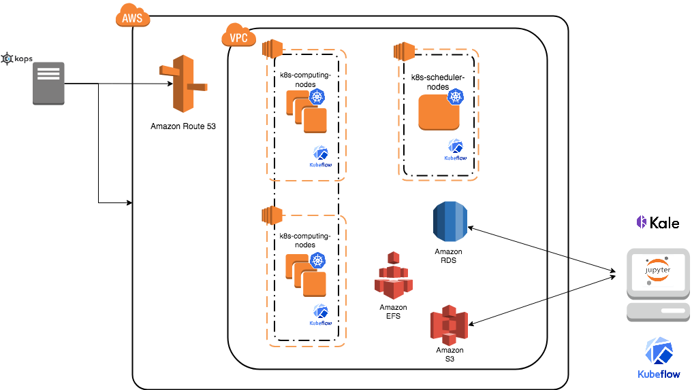

Cluster creation (first time only)
==================================

Kube SIPECAM cluster uses Kubernetes which is an open-source system for automating deployment, scaling, and management of containerized applications (see `Kubernetes`_ and `Kubernetes github page`_ ). 

The nex steps follow `kops`_ and `kops - Kubernetes Operations`_ guides (another guide: `Step Zero Kubernetes on AWS`_).

1. Configure a domain and a subdomain with their respective hosted zones. For the following description `Route 53`_ service of AWS was used to create domain ``conabio-route53.net`` and subdomain ``antares3.conabio-route53.net``. Also a **gossip based Kubernetes cluster** can be used instead (see for example this `issue`_ ).

2. Install **same versions** of kops and kubectl. You can use a ``t2.micro`` ec2 instance with AMI ``Ubuntu 18.04 LTS`` and a role attached to it with ``AmazonEc2FullAccess`` to install this tools and label it with the next bash script:
 
**Note: change region in next bash script where you deployed t2.micro instance**

.. code-block:: bash

	#!/bin/bash
	##variables:
	region=<region>
	name_instance=conabio-kubernetes
	shared_volume=/shared_volume
	user=ubuntu
	##System update
        export DEBIAN_FRONTEND=noninteractive
        apt-get update -yq
	##Install awscli
	apt-get install -y python3-pip && pip3 install --upgrade pip
	pip3 install awscli --upgrade
	##Tag instance
	INSTANCE_ID=$(curl -s http://instance-data/latest/meta-data/instance-id)
	PUBLIC_IP=$(curl -s http://instance-data/latest/meta-data/public-ipv4)
	aws ec2 create-tags --resources $INSTANCE_ID --tag Key=Name,Value=$name_instance-$PUBLIC_IP --region=$region
	##Set variables for completion of bash commands
	echo "export LC_ALL=C.UTF-8" >> /home/$user/.profile
	echo "export LANG=C.UTF-8" >> /home/$user/.profile
	##Set variable mount_point
	echo "export mount_point=$shared_volume" >> /home/$user/.profile
	##Useful software for common operations
	apt-get install -y nfs-common jq git htop nano
	##Create shared volume
	mkdir $shared_volume
	##install docker for ubuntu:
	apt-get install -y apt-transport-https ca-certificates curl software-properties-common
	curl -fsSL https://download.docker.com/linux/ubuntu/gpg | sudo apt-key add -
	add-apt-repository "deb [arch=amd64] https://download.docker.com/linux/ubuntu $(lsb_release -cs) stable"
	apt-get update -yq
	apt-get install -y docker-ce
	service docker start
	##install kops version 1.14.0:
	wget -O kops https://github.com/kubernetes/kops/releases/download/1.14.0/kops-linux-amd64
        chmod +x ./kops
	sudo mv ./kops /usr/local/bin/
	##install kubernetes command line tool v1.14: kubectl
        wget -O kubectl https://storage.googleapis.com/kubernetes-release/release/v1.14.0/bin/linux/amd64/kubectl
        chmod +x ./kubectl
	sudo mv ./kubectl /usr/local/bin/kubectl
	##enable completion for kubectl:
	echo "source <(kubectl completion bash)" >> /home/$user/.bashrc

You can check kops and kubectl versions with:

.. code-block:: bash

	$kops version

	$kubectl version

.. note:: 
	
	All ``kubectl`` and ``kops`` commands must be executed in this instance.

3. Set next bash variables:
 
.. code-block:: bash

	#Your domain name that is hosted in AWS Route 53
	#Use: export DOMAIN_NAME="antares3.k8s.local" #for a gossip based cluster
	export DOMAIN_NAME="antares3.conabio-route53.net"
	
	# Friendly name to use as an alias for your cluster
	export CLUSTER_ALIAS="k8s-deployment"
	
	# Leave as-is: Full DNS name of you cluster
	export CLUSTER_FULL_NAME="${CLUSTER_ALIAS}.${DOMAIN_NAME}"
	
	# AWS availability zone where the cluster will be created
        export CLUSTER_AWS_AZ=us-west-2a,us-west-2b,us-west-2c
	
	# Leave as-is: AWS Route 53 hosted zone ID for your domain (don't set it if gossip based cluster is used)
	export DOMAIN_NAME_ZONE_ID=$(aws route53 list-hosted-zones \
	       | jq -r '.HostedZones[] | select(.Name=="'${DOMAIN_NAME}'.") | .Id' \
	       | sed 's/\/hostedzone\///')
	
	export KUBERNETES_VERSION="1.14.0"
	
	#To hold cluster state information export KOPS_STATE_STORE
	export KOPS_STATE_STORE="s3://${CLUSTER_FULL_NAME}-state"

	export EDITOR=nano

4. Create AWS S3 bucket to hold information for Kubernetes cluster:

.. note:: 

	The instance needs the policy **AmazonS3FullAccess** attach to a role created by you to have permissions to execute next command.
	

.. code-block:: bash

    #Bucket will be created in us-east (N. Virginia)
    $aws s3api create-bucket --bucket ${CLUSTER_FULL_NAME}-state
	

5. Create group and user kops and generate access keys for user kops:

.. note:: 
	
	The instance needs the policy **IAMFullAccess** attach to a role created by you to have permissions to execute next command.

Create group and permissions of it:

.. code-block:: bash

        $name=kops

	$aws iam create-group --group-name $name

	$aws iam attach-group-policy --policy-arn arn:aws:iam::aws:policy/AmazonEC2FullAccess --group-name $name

	$aws iam attach-group-policy --policy-arn arn:aws:iam::aws:policy/AmazonRoute53FullAccess --group-name $name 

	$aws iam attach-group-policy --policy-arn arn:aws:iam::aws:policy/AmazonS3FullAccess --group-name $name 

	$aws iam attach-group-policy --policy-arn arn:aws:iam::aws:policy/IAMFullAccess --group-name $name 

	$aws iam attach-group-policy --policy-arn arn:aws:iam::aws:policy/AmazonVPCFullAccess --group-name $name 

	$aws iam attach-group-policy --policy-arn arn:aws:iam::aws:policy/AmazonElasticFileSystemFullAccess --group-name $name

Create user kops and add it to already created group kops:

.. code-block:: bash

	$aws iam create-user --user-name $name 

	$aws iam add-user-to-group --user-name $name --group-name $name

Create access keys for user kops:

.. code-block:: bash

	$aws iam create-access-key --user-name $name
 

This will generate an **AccessKeyId** and **SecretAccessKey** that must be kept in a safe place. Use them to configure awscli and set next variables:

.. code-block:: bash

	$aws configure 
		AWS Access Key ID [None]: xxxx
		AWS Secret Access Key [None]: xxxxxxx
		Default region name [None]: <leave it empty>
		Default output format [None]: <leave it empty>

	$export AWS_ACCESS_KEY_ID=$(aws configure get aws_access_key_id)

	$export AWS_SECRET_ACCESS_KEY=$(aws configure get aws_secret_access_key)

6. Create a Key Pair with AWS console and a Public Key. See `Amazon EC2 Key Pairs`_ sections: **Creating a Key Pair Using Amazon EC2** and **Creating a Key Pair Using Amazon EC2**. Save the Public Key in ``/home/ubuntu/.ssh/id_rsa.pub``.

7. Deploy Kubernetes Cluster. An example is:

.. code-block:: bash

	$kops create cluster \
	--name=${CLUSTER_FULL_NAME} \
	--zones=${CLUSTER_AWS_AZ} \
	--master-size="t2.medium" \
	--node-size="t2.medium" \
	--node-count="1" \
	--dns-zone=${DOMAIN_NAME} \
	--ssh-public-key="/home/ubuntu/.ssh/id_rsa.pub" \
	--kubernetes-version=${KUBERNETES_VERSION}

        $kops update cluster --name ${CLUSTER_FULL_NAME} --yes

.. note:: 

	Check status of cluster with ``kops validate cluster`` and wait until it says **Your cluster $CLUSTER_FULL_NAME	is ready**

.. note::

	You can delete cluster with: ``$kops delete cluster ${CLUSTER_FULL_NAME}`` and then ``$kops delete cluster ${CLUSTER_FULL_NAME} --yes`` (without ``yes`` flag you only see what changes are going to be applied) and don't forget to delete S3 bucket: ``$aws s3api delete-bucket --bucket ${CLUSTER_FULL_NAME}-state`` after cluster deletion.

.. note:: 

	You can scale up/down nodes of cluster with command: ``$kops edit ig nodes --name $CLUSTER_FULL_NAME``, edit screen that appears and set 3/0 number of instances in minSize, maxSize values (3 is an example) and then ``$kops update cluster $CLUSTER_FULL_NAME`` and  ``$kops update cluster $CLUSTER_FULL_NAME --yes`` to apply changes. Command ``kops validate cluster`` is useful to see state of cluster. 

.. note:: 

	To scale up/down master you can use: ``$kops edit ig master-us-west-2a --name $CLUSTER_FULL_NAME`` (you can check your instance type of master with: ``$kops get instancegroups``) set 1/0 number of instances in minSize, maxSize values and then ``$kops update cluster $CLUSTER_FULL_NAME`` and ``$kops update cluster $CLUSTER_FULL_NAME --yes`` to apply changes. Command ``kops validate cluster`` is useful to see state of cluster. 

**¿How do I ssh to an instance of Kubernetes Cluster?**

Using the key-pem already created for the kops user execute:

.. code-block:: bash

    $ssh -i <key>.pem admin@api.$CLUSTER_FULL_NAME

.. note:: 

	Make sure this <key>.pem has 400 permissions: ``$chmod 400 <key>.pem``.

You can also deploy kubernetes dashboard for your cluster.

Kubernetes dashboard
--------------------

According to `Kubernetes Dashboard`_ kubernetes dashboard is a general purpose, web-based UI for kubernetes clusters. It allows users to manage applications running in the cluster and troubleshoot them, as well as manage the cluster itself.

Next steps are based on: `Certificate management`_, `Installation`_, `Accessing Dashboard 1.7.X and above`_ and `Creating sample user`_ from kubernetes official documentation and installation of `Certbot for Ubuntu (18.04) bionic`_ and `certbot-dns-route53`_ to generate certificates and access kubernetes dashboard via https.

Install certbot and Route53 plugin for Let's Encrypt client:

.. code-block:: bash

	$sudo apt-get update
	$sudo apt-get install -y software-properties-common
        $sudo add-apt-repository universe
	$sudo add-apt-repository ppa:certbot/certbot
	$sudo apt-get update
	$sudo apt-get install -y certbot
	#check version of certbot and install route53 plugin:
	certbot_v=$(certbot --version|cut -d' ' -f2)
	$sudo pip3 install certbot_dns_route53==$certbot_v

Create some useful directories:

.. code-block:: bash

	$mkdir -p ~/letsencrypt/log/	
	$mkdir -p ~/letsencrypt/config/
	$mkdir -p ~/letsencrypt/work/

Using ``kubectl`` retrieve where is kubernetes master running:

.. code-block:: bash

	$ kubectl cluster-info
	Kubernetes master is running at <location>
	KubeDNS is running at <location>/api/v1/namespaces/kube-system/services/kube-dns:dns/proxy
	
	To further debug and diagnose cluster problems, use 'kubectl cluster-info dump'.

Generate certificate for the <location> (remove https if it's the case, just the dns name) of last command (make sure to save directory letsencrypt in a safe place):

.. code-block:: bash

	$certbot certonly -d <location> --dns-route53 --logs-dir letsencrypt/log/ --config-dir letsencrypt/config/ --work-dir letsencrypt/work/ -m myemail@myinstitution --agree-tos --non-interactive --dns-route53-propagation-seconds 20

.. note::

	Make sure you save the date that will expire your certificate. To renew certificate execute:
	
	.. code-block:: bash
	
		$certbot renew --dns-route53 --logs-dir letsencrypt/log/ \
		 --config-dir letsencrypt/config/ --work-dir letsencrypt/work/ \
		 --non-interactive	

.. note::
    Also you need to have some symlinks created under directory: ``letsencrypt/config/live/<location>``:

    .. code-block:: bash

        cert.pem -> ../../archive/<location>/cert1.pem
        chain.pem -> ../../archive/<location>/chain1.pem
        fullchain.pem -> ../../archive/<location>/fullchain1.pem
        privkey.pem -> ../../archive/<location>/privkey1.pem

Create directory ``certs`` and copy cert and private key:

.. code-block:: bash

	$mkdir certs
	$cp letsencrypt/config/archive/<location>/fullchain1.pem certs/
	$cp letsencrypt/config/archive/<location>/privkey1.pem certs/

.. note::

	When renewing your certificate the latest ones will be symlinks located: ``letsencrypt/config/live/<location>/``. See `Where are my certificates?`_ 
	

Retrieve `yaml` to deploy kubernetes dashboard and change some values:

.. code-block:: bash

    $curl -O https://raw.githubusercontent.com/kubernetes/dashboard/v2.0.0-rc5/aio/deploy/recommended.yaml
    $sed -ni 's/- --auto-generate-certificates/#- --auto-generate-certificates/;p' recommended.yaml
    $sed -i '/args:/a \ \ \ \ \ \ \ \ \ \ \ \ - --tls-cert-file=fullchain1.pem' recommended.yaml
    $sed -i '/args:/a \ \ \ \ \ \ \ \ \ \ \ \ - --tls-key-file=privkey1.pem' recommended.yaml
 

Create deployments and services with ``kubernetes-dashboard.yaml`` :

.. code-block:: bash

	$kubectl apply -f recommended.yaml 

Delete `certs` and recreate secrets using the `.pem` that we created with `certbot`:

.. code-block:: bash

        $kubectl delete secret kubernetes-dashboard-certs -n kubernetes-dashboard
        $kubectl create secret generic kubernetes-dashboard-certs --from-file=certs -n kubernetes-dashboard

You can check that containers are running by executing:

.. code-block:: bash

    $kubectl -n kubernetes-dashboard get pods

To visualize kubernetes-dashboard one possibility is to change type ``ClusterIP`` to ``NodePort`` (see `Accessing Dashboard 1.7.X and above`_) when executing next command:

.. code-block:: bash

	$kubectl edit service kubernetes-dashboard -n kubernetes-dashboard

and get port with:

.. code-block:: bash

	$kubectl get service kubernetes-dashboard -n kubernetes-dashboard 

Open port retrieved by last command in masters security group of kubernetes cluster with aws console. In your browser type:

``https://<location>:<port>``

Documentation of `Creating sample user`_ can be used to access via token generation. Use: 

.. code-block:: bash

    kubectl -n kubernetes-dashboard describe secret $(kubectl -n kubernetes-dashboard get secret | grep admin-user | awk '{print $1}')

to retrieve token.	

.. image:: imgs/k8s-dashboard-1.png
	:width: 400

.. image:: imgs/k8s-dashboard-2.png
	:width: 400

To scale down components of kubernetes dashboard:

.. code-block:: bash

        $kubectl -n kubernetes-dashboard scale deployments/dashboard-metrics-scraper --replicas=0
        $kubectl -n kubernetes-dashboard scale deployments/kubernetes-dashboard --replicas=0

To scale up components of kubernetes dashboard:

.. code-block:: bash

        $kubectl -n kubernetes-dashboard scale deployments/dashboard-metrics-scraper --replicas=1
        $kubectl -n kubernetes-dashboard scale deployments/kubernetes-dashboard --replicas=1

To delete components of kubernetes dashboard:

.. code-block:: bash

        #delete admin-user created:

        $kubectl -n kubernetes-dashboard delete serviceaccount admin-user
        $kubectl -n kubernetes-dashboard delete ClusterRoleBinding admin-user

        #delete dashboard components:
        $kubectl delete deployment kubernetes-metrics-scraper -n kubernetes-dashboard
        $kubectl delete deployment kubernetes-dashboard -n kubernetes-dashboard
        $kubectl delete service dashboard-metrics-scraper -n kubernetes-dashboard
        $kubectl delete clusterrolebinding kubernetes-dashboard -n kubernetes-dashboard
        $kubectl delete rolebinding kubernetes-dashboard -n kubernetes-dashboard
        $kubectl delete clusterrole kubernetes-dashboard -n kubernetes-dashboard
        $kubectl delete role kubernetes-dashboard -n kubernetes-dashboard
        $kubectl delete configmap kubernetes-dashboard-settings -n kubernetes-dashboard
        $kubectl delete secret kubernetes-dashboard-key-holder -n kubernetes-dashboard
        $kubectl delete secret kubernetes-dashboard-csrf -n kubernetes-dashboard
        $kubectl delete service kubernetes-dashboard -n kubernetes-dashboard
        $kubectl delete serviceaccount kubernetes-dashboard -n kubernetes-dashboard
        $kubectl delete secret kubernetes-dashboard-certs -n kubernetes-dashboard
        $kubectl delete namespace kubernetes-dashboard -n kubernetes-dashboard
	
	
Cluster deployment
==================

Once cluster is created in ``us-west-2`` region launch a ``t2.micro`` instance with AMI ``Ubuntu-20.04`` in which we will execute ``kubectl`` commands to deploy cluster. 

Use next *bash script* which will install ``docker``, ``kops`` and ``kubectl``. Also choose a suitable name for your instance and write it as value of ``name_instance`` variable.

.. code-block:: bash

         #!/bin/bash
         ##variables:
         region=us-west-2
         name_instance=###############here write a suitable name for your t2 micro instance
         shared_volume=/shared_volume
         user=ubuntu
         ##System update
         export DEBIAN_FRONTEND=noninteractive
         apt-get update -yq
         ##Install awscli
         apt-get install -y python3-pip && pip3 install --upgrade pip
         pip3 install awscli --upgrade
         ##Tag instance
         INSTANCE_ID=$(curl -s http://instance-data/latest/meta-data/instance-id)
         PUBLIC_IP=$(curl -s http://instance-data/latest/meta-data/public-ipv4)
         aws ec2 create-tags --resources $INSTANCE_ID --tag Key=Name,Value=$name_instance-$PUBLIC_IP --region=$region
         ##Set variables for completion of bash commands
         echo "export LC_ALL=C.UTF-8" >> /home/$user/.profile
         echo "export LANG=C.UTF-8" >> /home/$user/.profile
         ##Set variable mount_point
         echo "export mount_point=$shared_volume" >> /home/$user/.profile
         ##Useful software for common operations
         apt-get install -y nfs-common jq git htop nano
         ##Create shared volume
         mkdir $shared_volume
         ##install docker for ubuntu:
         apt-get install -y apt-transport-https ca-certificates curl software-properties-common
         curl -fsSL https://download.docker.com/linux/ubuntu/gpg | sudo apt-key add -
         add-apt-repository "deb [arch=amd64] https://download.docker.com/linux/ubuntu $(lsb_release -cs) stable"
         apt-get update -yq
         apt-get install -y docker-ce
         service docker start
         ##install kops version 1.19.0:
         wget -O kops https://github.com/kubernetes/kops/releases/download/v1.19.1/kops-linux-amd64
         chmod +x ./kops
         sudo mv ./kops /usr/local/bin/
         ##install kubernetes command line tool v1.19: kubectl
         wget -O kubectl https://storage.googleapis.com/kubernetes-release/release/v1.19.1/bin/linux/amd64/kubectl
         chmod +x ./kubectl
         sudo mv ./kubectl /usr/local/bin/kubectl
         ##enable completion for kubectl:
         echo "source <(kubectl completion bash)" >> /home/$user/.bashrc        

Scale up of worker nodes
------------------------

Use ``ssh`` to login to ec2 instance. Choose which type of cluster you will use and set next variables accordingly:

.. code-block:: bash

         # For testing
         
         export DOMAIN_NAME="dummy.route53-kube-sipecam.net"
         export CLUSTER_ALIAS="k8s-dummy"
         export CLUSTER_FULL_NAME="${CLUSTER_ALIAS}.${DOMAIN_NAME}"
         export KUBERNETES_VERSION="1.19.1"
         export KOPS_STATE_STORE="s3://${CLUSTER_FULL_NAME}-state"
         export EDITOR=nano
         
         # For production
         
         export DOMAIN_NAME="proc-sys.route53-kube-sipecam.net"
         export CLUSTER_ALIAS="k8s"
         export CLUSTER_FULL_NAME="${CLUSTER_ALIAS}.${DOMAIN_NAME}"
         export KUBERNETES_VERSION="1.19.1"
         export KOPS_STATE_STORE="s3://${CLUSTER_FULL_NAME}-state"
         export EDITOR=nano	 

Scale up worker nodes of cluster using ``kops``.

.. code-block:: bash

         kops edit ig nodes-us-west-2a --name $CLUSTER_FULL_NAME
	 
.. note::

         If you will use GPU then add under ``spec`` next lines:
	 
	 .. code-block:: bash
	 
		  dummy line to trigger build

Next line is just to see what changes are going to be applied.

.. code-block:: bash

         kops update cluster --name $CLUSTER_FULL_NAME

Apply the changes.

.. code-block:: bash

         kops update cluster --name $CLUSTER_FULL_NAME --yes --admin

Next line is useful to know when cluster is ready.

.. code-block:: bash

         kops validate cluster --wait 10m

Scale up of components
----------------------

When cluster is ready **scale up** next:

* Dashboard components

.. code-block:: bash

         kubectl -n kubernetes-dashboard scale deployments/dashboard-metrics-scraper --replicas=1
         kubectl -n kubernetes-dashboard scale deployments/kubernetes-dashboard --replicas=1
	 
Get port of dashboard UI with:

.. code-block:: bash

         kubectl get service kubernetes-dashboard -n kubernetes-dashboard
	 
Access dashboard UI:

``https://api.$CLUSTER_ALIAS.$DOMAIN_NAME:<port retrieved with last command>``

* Elastic File System

.. code-block:: bash
 
         kubectl -n kubeflow scale deployments/nfs-client-provisioner --replicas=1
	 
* Kubeflow components

.. code-block:: bash

         kubectl scale -n kubeflow deployment cache-deployer-deployment --replicas=1
         kubectl scale -n kubeflow deployment cache-server --replicas=1
         kubectl scale -n kubeflow deployment workflow-controller --replicas=1
         kubectl scale -n kubeflow deployment ml-pipeline-ui --replicas=1
         kubectl scale -n kubeflow deployment ml-pipeline-scheduledworkflow --replicas=1
         kubectl scale -n kubeflow deployment ml-pipeline-persistenceagent --replicas=1
         kubectl scale -n kubeflow deployment ml-pipeline --replicas=1
         kubectl scale -n kubeflow deployment metadata-writer --replicas=1
         kubectl scale -n kubeflow deployment metadata-envoy-deployment --replicas=1
         kubectl scale -n kubeflow deployment metadata-grpc-deployment --replicas=1
         kubectl scale -n kubeflow deployment ml-pipeline-viewer-crd --replicas=1
         kubectl scale -n kubeflow deployment ml-pipeline-visualizationserver --replicas=1
         kubectl scale -n kubeflow deployment mysql --replicas=1
         kubectl scale -n kubeflow deployment controller-manager --replicas=1
	 
Get port of kubeflow UI with:

.. code-block:: bash

         kubectl get service ml-pipeline-ui -n kubeflow
	 
Access kubeflow dashboard UI:

``http://api.$CLUSTER_ALIAS.$DOMAIN_NAME:<port retrieved with last command>``

* Jupyterlab service

.. code-block:: bash
 
         kubectl -n kubeflow scale deployments/kale-jupyterlab --replicas=1
	 
Access jupyterlab UI:

``https://api.$CLUSTER_ALIAS.$DOMAIN_NAME:30001/myurl``
	 

Scale down of components
------------------------

Once the work is done **scale down** next:

* Kubeflow components

.. code-block:: bash

         kubectl scale -n kubeflow deployment cache-deployer-deployment --replicas=0
         kubectl scale -n kubeflow deployment cache-server --replicas=0
         kubectl scale -n kubeflow deployment workflow-controller --replicas=0
         kubectl scale -n kubeflow deployment ml-pipeline-ui --replicas=0
         kubectl scale -n kubeflow deployment ml-pipeline-scheduledworkflow --replicas=0
         kubectl scale -n kubeflow deployment ml-pipeline-persistenceagent --replicas=0
         kubectl scale -n kubeflow deployment ml-pipeline --replicas=0
         kubectl scale -n kubeflow deployment metadata-writer --replicas=0
         kubectl scale -n kubeflow deployment metadata-envoy-deployment --replicas=0
         kubectl scale -n kubeflow deployment metadata-grpc-deployment --replicas=0
         kubectl scale -n kubeflow deployment ml-pipeline-viewer-crd --replicas=0
         kubectl scale -n kubeflow deployment ml-pipeline-visualizationserver --replicas=0
         kubectl scale -n kubeflow deployment mysql --replicas=0
         kubectl scale -n kubeflow deployment controller-manager --replicas=0

* Dashboard components

.. code-block:: bash

         kubectl -n kubernetes-dashboard scale deployments/dashboard-metrics-scraper --replicas=0
         kubectl -n kubernetes-dashboard scale deployments/kubernetes-dashboard --replicas=0
	 
* Elastic File System

.. code-block:: bash
 
         kubectl -n kubeflow scale deployments/nfs-client-provisioner --replicas=0
	 
* Jupyterlab service

.. code-block:: bash
 
         kubectl -n kubeflow scale deployments/kale-jupyterlab --replicas=0
	 
Scale down of worker nodes
--------------------------

Wait 5 minutes then scale down worker nodes of cluster using ``kops``.

.. code-block:: bash

         kops edit ig nodes-us-west-2a --name $CLUSTER_FULL_NAME
	 
Next line is just to see what changes are going to be applied.

.. code-block:: bash

         kops update cluster --name $CLUSTER_FULL_NAME

Apply the changes.

.. code-block:: bash

         kops update cluster --name $CLUSTER_FULL_NAME --yes --admin
	 
	 
Terminate ``t2.micro`` instance.
	 
	 
.. Kubernetes references:

.. _JupyterHub: https://jupyterhub.readthedocs.io/en/stable/

.. _Running a notebook server: https://jupyter-notebook.readthedocs.io/en/stable/public_server.html#running-a-notebook-server

.. _JupyterLab: jupyterlab.readthedocs.io/en/stable/

.. _Run Heapster in a Kubernetes cluster with an InfluxDB backend and a Grafana UI: https://github.com/kubernetes/heapster/blob/master/docs/influxdb.md

.. _metrics-server: https://github.com/kubernetes-incubator/metrics-server

.. _heapster: https://github.com/kubernetes/heapster/

.. _Where are my certificates?: https://certbot.eff.org/docs/using.html#where-are-my-certificates

.. _certbot-dns-route53: https://certbot-dns-route53.readthedocs.io/en/latest/#

.. _Certbot for Ubuntu (18.04) bionic: https://certbot.eff.org/lets-encrypt/ubuntubionic-other

.. _Creating sample user: https://github.com/kubernetes/dashboard/blob/master/docs/user/access-control/creating-sample-user.md 

.. _Accessing Dashboard 1.7.X and above: https://github.com/kubernetes/dashboard/blob/master/docs/user/accessing-dashboard/1.7.x-and-above.md 

.. _Installation: https://github.com/kubernetes/dashboard/blob/master/docs/user/installation.md 

.. _Certificate management: https://github.com/kubernetes/dashboard/blob/master/docs/user/certificate-management.md 

.. _Kubernetes Dashboard: https://github.com/kubernetes/dashboard

.. _Best Practices in Dask Kubernetes: https://dask-kubernetes.readthedocs.io/en/latest/#best-practices

.. _Assign Memory Resources to Containers and Pods: https://kubernetes.io/docs/tasks/configure-pod-container/assign-memory-resource/#specify-a-memory-request-and-a-memory-limit

.. _Assign CPU Resources to Containers and Pods: https://kubernetes.io/docs/tasks/configure-pod-container/assign-cpu-resource/

.. _Managing Compute Resources for Containers: https://kubernetes.io/docs/concepts/configuration/manage-compute-resources-container/

.. _efs-provisioner: https://github.com/kubernetes-incubator/external-storage/tree/master/aws/efs

.. _Amazon EC2 Key Pairs: https://docs.aws.amazon.com/AWSEC2/latest/UserGuide/ec2-key-pairs.html

.. _Kubernetes github page: https://github.com/kubernetes/kubernetes

.. _Kubernetes: https://kubernetes.io/

.. _kops - Kubernetes Operations: https://github.com/kubernetes/kops

.. _kops: https://kubernetes.io/docs/setup/custom-cloud/kops/

.. _Route 53: https://aws.amazon.com/route53/?nc1=h_ls

.. _issue: https://github.com/kubernetes/kops/issues/2858  

.. _Step Zero Kubernetes on AWS: https://zero-to-jupyterhub.readthedocs.io/en/latest/amazon/step-zero-aws.html

.. _Why change reclaim policy of a PersistentVolume: https://kubernetes.io/docs/tasks/administer-cluster/change-pv-reclaim-policy/
